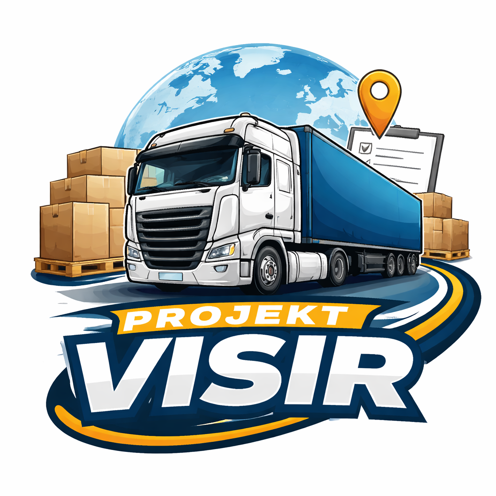

# Lönsamhetskalkyl



Kandidatprojekt vid Linköpings Universitet åt Börjes Koncernen att ta fram ett program som ska räkna på lönsamhet.

## Projektstruktur

Projektet är indelat i två huvuddelar:

- **[web/](web/)** - Next.js fullstack webbapplikation för trafikledning och lönsamhetsanalys
- **[ml-backend/](ml-backend/)** - Node.js Express server (framtida ML/NN-integrationspunkt)

## Snabbstart

### Webbappen (Next.js)

```bash
cd web
npm install
npm run dev
```

Öppna http://localhost:3000.

Se [web/README.md](web/README.md) för detaljerad dokumentation av webbappen, funktioner, och API.

### Vanliga kommandon (web)

- `npm run dev` - Startar utvecklingsservern, programmera och se ändringar live
- `npm run build` - Bygger för produktion, kompilerar koden.
- `npm run start` - Kör den byggda produktionen lokalt

### Om dev-servern kraschar (cacheproblem)

```bash
cd web
rm -rf .next
npm run dev
```

## Arkitektur & Teknologi

### Fullstack i Next.js

Denna lösning använder ett fullstack-upplägg i Next.js:

- **Frontend** - React TSX-komponenter som körs i webbläsaren
- **Backend** - API-routes under `app/api/` som körs server-side
- **Database** - Supabase för datalagringing och autentisering

Tack vare detta kan vi utveckla både frontend och backend i ett, med separation av server-side och client-side logik.

### Mappstruktur

```
lonsamhetskalkyl/
├── web/                          # Next.js webbapplikation
│   ├── app/                       # Routes, sidor och API
│   ├── components/                # Återanvänndbara UI-komponenter
│   ├── lib/                       # Shared utilities, API-klienter
│   ├── styles/                    # Global styling
│   └── README.md                  # Webbapp-specifik dokumentation
├── ml-backend/                    # Framtida ML/NN-service (Node.js)
└── README.md                      # Denna fil
```

### Teknologistac

- **Frontend & Backend**: Next.js med TypeScript (TSX)
- **Styling**: Tailwind CSS
- **State Management**: React hooks
- **Database**: Supabase
- **API**: Next.js Route Handlers
- **Framtida ML**: Python

## Hur delar pratar tillsammans

### Server-side vs Client-side

I Next.js app router:

- **Server components** (default) - Körs på servern, kan läsa hemliga env och prata med DB
- **Client components** (`"use client"`) - Körs i webbläsaren, kan använda state och event handlers
- **API routes** (`app/api/`) - Körs alltid server-side

Tumregel:

- Om du använder `window`, `document`, eller event handlers (onClick) → **client-side**
- Om du läser hemliga env, pratar med DB, eller gör autentisering → **server-side**

### Dataflöde exempel

1. Frontend (client component) skickar formdata eller begär data
2. API-route (server-side) validerar och pratar med Supabase
3. Resultat returneras som JSON till klienten
4. Frontend uppdaterar UI

## Miljövaribler

### Frontend (public)

Dessa är OK för att exponeras till frontend:

- `NEXT_PUBLIC_SUPABASE_URL` - Supabase projekt-URL

### Backend (hemlig)

Dessa får **ALDRIG** exponeras till frontend:

- `SUPABASE_SERVICE_ROLE_KEY` - Supabase service role nyckel (server-side only)

## Framtida ML/NN-backend

För tunga beräkningar är en separat Python-service rekommenderat:

**Copilots förslag:**

- **Framework**: FastAPI + Uvicorn (snabbt, tydliga typer)
- **Deployment**: Egen URL som Next.js anropar server-side
- **Långtidkörningar**: Använd job queue (Redis + Celery) för async jobb

## Supabase Integration

Supabase hanteras **alltid server-side** via:

- [web/lib/supabaseServer.ts](web/lib/supabaseServer.ts) - Server-only Supabase-klient
- [web/app/api/message/route.ts](web/app/api/message/route.ts) - Exempel på API-route som sparar till DB
